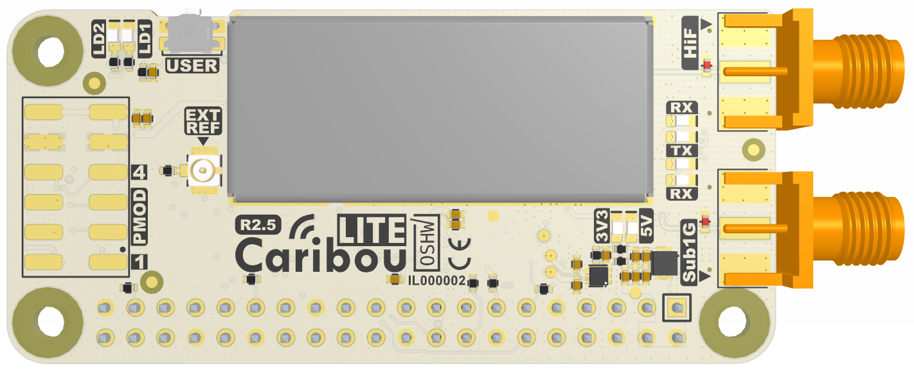
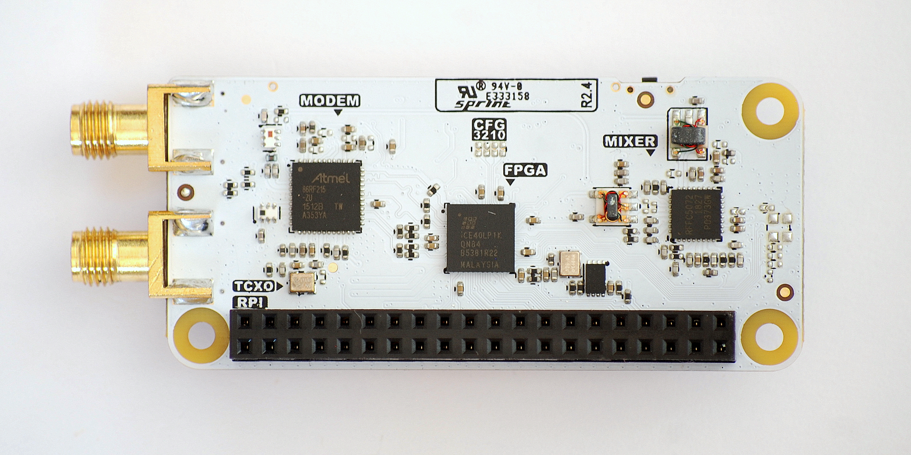
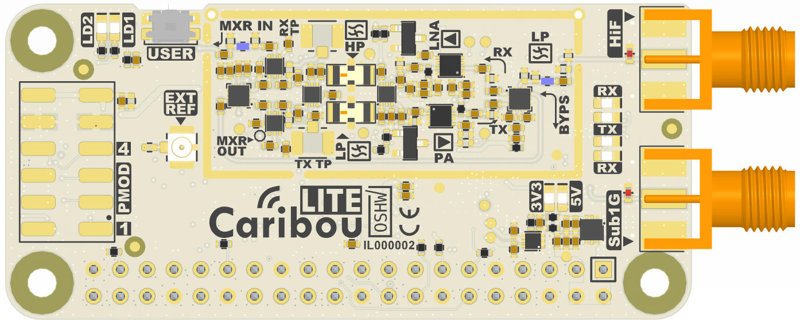
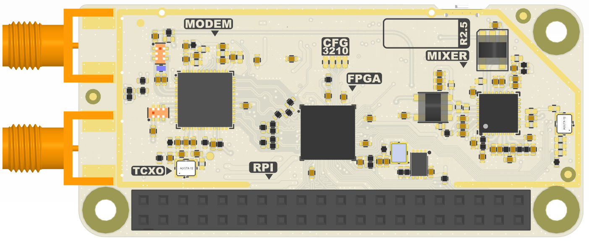
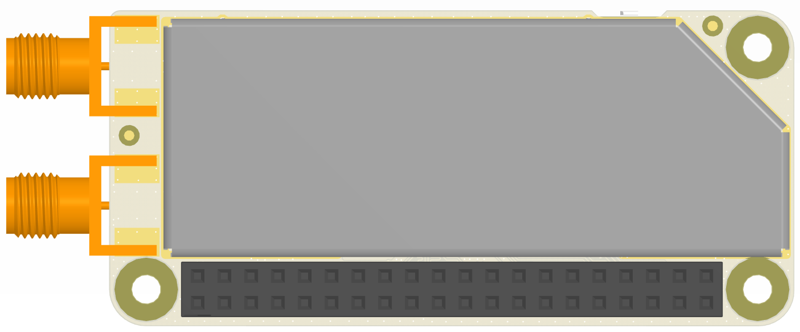

# CaribouLite
CaribouLite is an affordable, educational, open-source SDR evaluation platform and a HAT for the Raspberry-Pi family of boards (40-pin versions only). It is built for makers, hackers, and researchers and was designed to complement the current SDR (Software Defined Radio) eco-systems offering with a scalable, standalone dual-channel software-defined radio.

<table>
  <tr>
    <td></td>
    <td>This project has been certified by OSHWA</td>
  </tr>
</table>

<table>
  <tr>
    <td></td>
  </tr>
  <tr>
    <td>CaribouLite R2.5 SDR mounted on a RPI-Zero</td>
  </tr>
</table>

# Getting Started & Installation
Use the following steps to install the CaribouLite on your choice of RPI board
1. Mount the CaribouLite on a **un-powered** RPI device using the 40-pin header.
2. Power the RPI device, wait for it to finish boot sequence.
3. Clone this repository into a local directory of your choise (in this case `~/projects`)
```
mkdir ~/projects
cd ~/projects
git clone https://github.com/cariboulabs/cariboulite
cd cariboulite
```
4. Use the following setup command (**note: don't `sudo` it**):
    ```
    install.sh
    ```

The setup script **requires internet connection** and it follows the following automatic steps:
1. **Dependencies** installation (apt)
2. **Soapy API tools installation** (SoapySDR and SoapyRemote) - only if they are not currently present in the system. Installation from code.
3. **Internal dependencies installation**
   1. Utilities and tools
   2. IIR DSP library
   3. SMI stream device module (kernel object) blob generation
4. **Main software** and SoapyAPI compilation and installation
5. **Raspberry PI configuration** verification. Note - the installer doesn't not actively change the RPI's configuration to fit to CaribouLite. It just checks the `/boot/config.txt` configuration file and raises warning when problem is detected. Then the user shall need to adjust the parameters accordingly.

Note: the user will be requested to enter his password during the installation process.

## Installation Troubleshooting
1. **Modules**: Both the `spi` and `arm-i2c` dtoverlays should be disabled to run CaribouLite properly. The `libcariboulite` doen't use them. It uses direct access to `/dev/mem` to expose these peripherals (through the `pigpio` library).
The interfaces can be disabled (or enabled back whenever needed) by either directly editing the `/dev/config.txt` file or by using the `sudo raspi-config` command. The latter is the preferred choice as it is straight forward, less error prone and it works on all RaspberryPi's OS distributions.
If the direct editing path has been chosen (`/boot/config.txt`), the following lines
should be commented out:
`#dtparam=spi=on`
`#dtparam=i2c_arm=on`

1. **Kernel headers** - `libcariboulite` loads a custom kernel module (`smi_stream_dev`) during startup. The kernel module sources are location in : **`/software/libcariboulite/caribou_smi/kernel`**. [**TBD**]

2.


To compile the API library and SoapySDR API from code please click [here](/software/libcariboulite/README.md)

# SMI Interface

Unlike many other HAT projects, CaribouLite utilizes the **SMI** (Secondary Memory Interface) present on all the 40-pin RPI versions. This interface is not thoroughly documented by both Raspberry-Pi documentation and Broadcomm's reference manuals. An amazing work done by [Lean2](https://iosoft.blog/2020/07/16/raspberry-pi-smi/) (code in [git repo](https://github.com/jbentham/rpi)) in hacking this interface has contributed to CaribouLite's technical feasibility. A deeper overview of the interface is provided by G.J. Van Loo, 2017 [Secondary_Memory_Interface.pdf](docs/smi/Secondary%20Memory%20Interface.pdf). The SMI interface allows exchanging up to ~500 Mbit/s (depending on the FPGA, data-bus width, etc.) between the RPI and the HAT, and yet, the results vary between the different versions of RPI. The results further depend on the specific RPI version's DMA speeds.

The SMI interface can be accessed from the user space Linux applications as shown in [Lean2](https://iosoft.blog/2020/07/16/raspberry-pi-smi/), but Broadcomm also provided a neat minimal charachter device interface in the `/dev` directory using the `open`, `close`, `write`, `read`, and `ioctl` system calls. More on this interesting interface in the [designated readme file](software/libcariboulite/src/caribou_smi/index.md). This device driver needs to be loaded using `modprobe`.

More information on this interface can be found [here (HW side)](docs/smi/README.md) and [here (SW side)](software/libcariboulite/src/caribou_smi/README.md).


<table>
  <tr>
    <td></td>
  </tr>
  <tr>
    <td>Cariboulite /w RPI Zero, two channels occupied</td>
  </tr>
</table>

# Hardware Revisions
The board first prototyping (**Red**) revision ([REV1](hardware/rev1)) has been produced and tested to meet our vision on the board's capabilities. This revision was used to test its RF parts, the digital parts, and to develop its firmware and software support over the RPI.


<table>
  <tr>
    <td></td>
    <td></td>
  </tr>
  <tr>
    <td>CaribouLite Rev1 - the prototype version</td>
    <td>CaribouLite Rev2.5 - Production Revision</td>
  </tr>
</table>

The second revision ([REV2](hardware/rev2)) - **White** - was then designed to further refine the design as described below:
1. Image rejection filtering improvement - U10 and U12 (HPF & LPF) - have been replaced by integrated LTCC filters by MiniCircuits with much better out-of-band rejection than the former ones.
2. Removing FPGA flash - redundant given the fact that the the RPI configures the FPGA in <1sec over SPI. Even if we have a whole library of custom made FPGA firmware files, switching between them is as simple and fast as a single linux command.
3. Board layout improvements and overlays (silkscreen) beautification (including logo).
4. A single system level 3.3V power (while the FPGA still receives 2.5V and 1.2V for its core). A linear regulator (rather than a switching DC-DC) was used to reduce conducted (power and ground) noise levels.
5. Top and bottom EMI sheilding option - the EMI/RFI shield design models are provided in the [3d directory](hardware/rev2/3d/)
6. More detailed changes in the [schematics](hardware/rev2/schematics/cariboulite_r2_sch.PDF).

In summary, in CaribouLite-Rev2.5 PCB design has been thoroughly re-thought to meet its educational needs with performance in mind. The RF path has been annotated with icons to ease the orientation in the schematics sheets, friendly silk writing was added describing system's components by their functionality rather than logical descriptors, and more.

<table>
  <tr>
    <td></td>
  </tr>
  <tr>
    <td></td>
  </tr>
  <tr>
    <td>Top and Bottom views of CaribouLite <b>Rev2.4</b> (pre-production)</td>
  </tr>
</table>

<table>
  <tr>
    <td></td>
    <td></td>
  </tr>
  <tr>
    <td></td>
  <td></td>
  </tr>
  <tr>
    <td>Top and Bottom views of CaribouLite <b>Rev2.5</b></td>
    <td>Top and Bottom views of CaribouLite <b>Rev2.5</b> with EMI/RFI shields</td>
  </tr>
</table>

# Specifications

<B>RF Channels:</B>
- Sub-1GHz: 389.5-510 MHz / 779-1020 MHz
- Wide tuning channel: 30 MHz - 6 GHz (excluding 2398.5-2400 MHz and 2483.5-2485 MHz)

<table>
  <tr>
    <td></td>
  </tr>
  <tr>
    <td style="text-align:center">Applicable spectra, S1G - sub-1GHz, WB - Wide tuning channel</td>
  </tr>
</table>
<B>Note</B>:
The gaps are defined by the design constraints of the system and may not exist in real-life hardware. Actual modem synthesizer outputs test show wider margins at room temperature than those written in the datatsheet, but, as noted by Microchip, performance may suffer.


<B>FPGA specifications:</B>
- 160 LABs / CLBs
- 1280 Logic Elements / Cells
- 65536 Total RAM bits
- 67 I/Os, Temp: -40-100 degC

<B>Applicable RPI models</B>: RPI_1(B+/A+), RPI_2B, RPI_Zero(Zero/W/WH), RPI_3(B/A+/B+), RPI_4B

Parameter                  |  Sub-1GHz                    | Wide Tuning Channel
---------------------------|------------------------------|------------------------------------------------------------------
Frequency tuner range      | 389.5-510 MHz / 779-1020 MHz | 30 MHz - 6 GHz (excluding 2398.5-2400 MHz and 2483.5-2485 MHz)
Sample rate (ADC / DAC)    | 4 MSPS                       | 4 MSPS
Analog bandwidth (Rx / Tx) | 2.5 MHz                      | 2.5 MHz
Max Transmit power         | 14 dBm                       | >10 dBm @ 30-2400 MHz, >5 dBm @ 2400-6000 MHz
Receive noise figure       | <5 dB                      | <6 dB @ 30-3500 MHz, <8 dB @ 3500-6000 MHz

<B>Note</B>:
(1) Feature comparison table with other SDR devices will be published shortly
(2) Some of the above specifications are simulated rather than tested
(3) Analog bandwidth controlled by the modem
(4) The ISM version of the board doesn't contain the wide-range of frequencies (30-6000 MHz) and contains the native capabilities of the Modem IC.

# Disclaimer
CaribouLite is a test equipment for RF systems. You are responsible for using your CaribouLite legally.

Definitions: THE SUBJECT CONTENT: all files, software, instructions, information, ideas and knowledge located in this git repository.

No Warranty: THE SUBJECT CONTENTS ARE PROVIDED "AS IS" WITHOUT ANY WARRANTY OF ANY KIND, EITHER EXPRESSED, IMPLIED, OR STATUTORY, INCLUDING, BUT NOT LIMITED TO, ANY WARRANTY THAT THE SUBJECT CONTENTS WILL CONFORM TO SPECIFICATIONS, ANY IMPLIED WARRANTIES OF MERCHANTABILITY, FITNESS FOR A PARTICULAR PURPOSE, OR FREEDOM FROM INFRINGEMENT, ANY WARRANTY THAT THE SUBJECT CONTENTS WILL BE ERROR FREE, OR ANY WARRANTY THAT DOCUMENTATION, IF PROVIDED, WILL CONFORM TO THE SUBJECT CONTENTS. FURTHER, THE REPOSITORY OWNERS AND CONTRIBUTORS DISCLAIM ALL WARRANTIES AND LIABILITIES REGARDING THIRD-PARTY SOFTWARE, IF PRESENT IN THE ORIGINAL SOFTWARE, AND DISTRIBUTE IT "AS IS."

Waiver and Indemnity: RECIPIENT AGREES TO WAIVE ANY AND ALL CLAIMS AGAINST THE REPOSITORY OWNERS AND CONTRIBUTORS, THEIR CONTRACTORS AND SUBCONTRACTORS, AS WELL AS ANY PRIOR RECIPIENT. IF RECIPIENT'S USE OF THE SUBJECT CONTENTS RESULTS IN ANY LIABILITIES, DEMANDS, DAMAGES, EXPENSES OR LOSSES ARISING FROM SUCH USE, INCLUDING ANY DAMAGES FROM PRODUCTS BASED ON, OR RESULTING FROM, RECIPIENT'S USE OF THE SUBJECT CONTENTS, RECIPIENT SHALL INDEMNIFY AND HOLD HARMLESS THE REPOSITORY OWNERS AND CONTRIBUTORS, THEIR CONTRACTORS AND SUBCONTRACTORS, AS WELL AS ANY PRIOR RECIPIENT, TO THE EXTENT PERMITTED BY LAW.

# License
<a rel="license" href="http://creativecommons.org/licenses/by-sa/4.0/"></a><br />This work is licensed under a <a rel="license" href="http://creativecommons.org/licenses/by-sa/4.0/">Creative Commons Attribution-ShareAlike 4.0 International License</a>.
