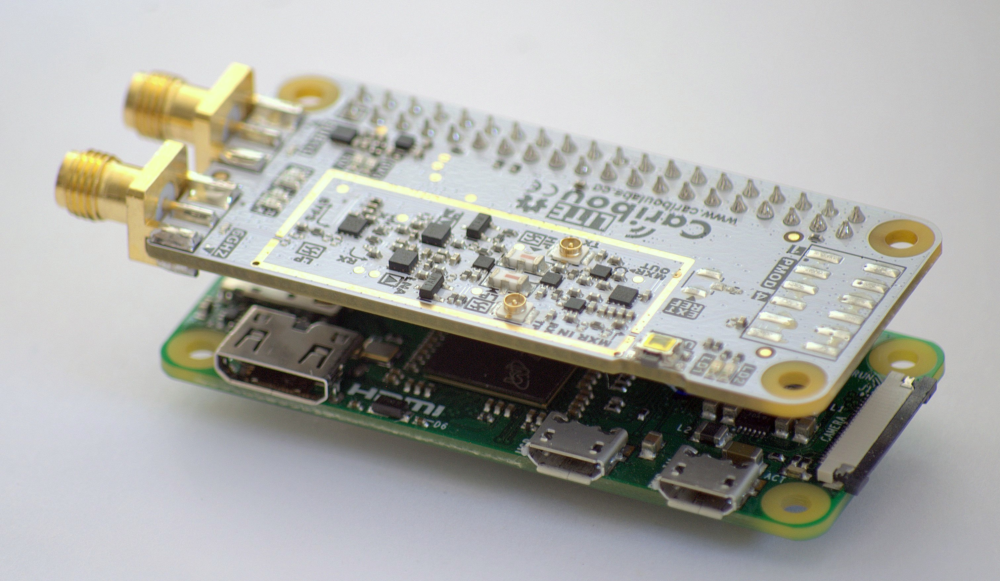

# CaribouLite
CaribouLite is an affordable, educational, open-source SDR platform that is also a HAT for the Raspberry-Pi family of boards (40-pin versions only). It is built for makers, hackers, and researchers and was designed to complement the SDR current eco-systems offering with a scalable, standalone dual-channel software-defined radio. 

<table>
  <tr>
    <td></td>
  </tr>
  <tr>
    <td>CaribouLite Rev#2 SDR mounted on a RPI-Zero</td>
  </tr>
</table>

<table>
  <tr>
    <td></td>
  </tr>
  <tr>
    <td>CaribouLite Rev#1 SDR mounted on a RPI-Zero</td>
  </tr>
</table>

Unlike many other HAT projects, CaribouLite utilizes the <B>SMI</B> (Secondary Memory Interface) present on all the 40-pin RPI versions. This interface is not thoroughly documented by both Raspberry-Pi documentation and Broadcomm's reference manuals. An amazing work done by [Lean2](https://iosoft.blog/2020/07/16/raspberry-pi-smi/) (code in [git repo](https://github.com/jbentham/rpi)) in hacking this interface contributes to CaribouLite's technical feasibility. A deeper overview of the interface is provided by G.J. Van Loo, 2017 [Secondary_Memory_Interface.pdf](docs/smi/Secondary%20Memory%20Interface.pdf). The SMI interface allows exchanging up to ~500Mbit/s between the RPI and the HAT, and yet, the results vary between the different versions of RPI. The results further depend on the specific RPI version's DMA speeds.

In our application, each ADC sample contains 13 bit (I) and 13 bit (Q), that are streamed with a maximal sample rate of 4 MSPS from the AT86RF215 IC. This channel requires 4 bytes (samples padded to 32-bit) per sample (and I/Q pair) => 16 MBytes/sec which are 128 MBits/sec. In addition to the 13 bit for each of I/Q, the Tx/Rx streams of data contain flow control and configuration bits. The modem (AT86RF215) IC by Microchip contains two RX I/Q outputs from its ADCs (one for each physical channel - sub-1GHz and 2.4GHz), and a single TX I/Q intput directed to the DACs.

CaribouLite has been submitted to CrowdSupply and has been pre-launched! [Visit our page](https://www.crowdsupply.com/cariboulabs/cariboulite)

# Hardware Revisions
**A working prototype version** of the board ([REV1](hardware/rev1)) has been produced and tested to meet product requirements. 
In the meantime, a second revision of the board is being produced with the following main updates (see picture below):
1. Image rejection filtering improvement - U10 and U12 (HPF & LPF) - have been replaced by integrated LTCC filters by MiniCircuits
2. Removing FPGA flash - redundant given the fact that the the RPI configures the FPGA in <1sec over SPI.
3. Board layout improvements and overlays (silkscreen) beautification (including logo)
4. A single system level 3.3V power (while the FPGA still receives 2.5V and 1.2V for its core). A linear regulator (rather than a switching DC-DC) was used to reduce conducted (power and ground) noise levels.
5. More detailed changes in the [schematics](hardware/rev2/schematics/cariboulite_r2_sch.PDF).

In CaribouLite-R2 the PCB design has been thoroughly re-thought to meet its educational needs. The RF path has been annotated with icons to ease the orientation in the schematics sheets, friendly silk writing was added describing system's components by their functionality rather than logical descriptors, and more.

<table>
  <tr>
    <td></td>
  </tr>
  <tr>
    <td>Top & Bottom view, Production Rev2</td>
  </tr>
</table>

**Deeper project details will be published shortly in our Wiki pages.**

# Specifications

<B>RF Channels:</B>
- Sub-1GHz: 389.5-510 MHz / 779-1020 MHz
- Wide tuning channel: 30 MHz - 6 GHz (excluding 2398.5-2400 MHz and 2483.5-2485 MHz)

<table>
  <tr>
    <td></td>
  </tr>
  <tr>
    <td style="text-align:center">Applicable spectra, S1G - sub-1GHz, WB - Wide tuning channel</td>
  </tr>
</table>
<B>Note</B>: 
The gaps are defined by the design constraints of the system and may not exist in real-life hardware. Actual modem synthesizer outputs test show wider margins at room temperature than those written in the datatsheet, but, as noted by Microchip, performance may suffer.

<B>FPGA specifications:</B>
- 160 LABs / CLBs
- 1280 Logic Elements / Cells
- 65536 Total RAM bits
- 67 I/Os, Temp: -40-100 degC

<B>Applicable RPI models</B>: RPI_1(B+/A+), RPI_2B, RPI_Zero(Zero/W/WH), RPI_3(B/A+/B+), RPI_4B

Parameter                  |  Sub-1GHz                    | Wide Tuning Channel
---------------------------|------------------------------|------------------------------------------------------------------
Frequency tuner range      | 389.5-510 MHz / 779-1020 MHz | 30 MHz - 6 GHz (excluding 2398.5-2400 MHz and 2483.5-2485 MHz)
Sample rate (ADC / DAC)    | 4 MSPS                       | 4 MSPS
Analog bandwidth (Rx / Tx) | <4 MHz                       | <4 MHz
Max Transmit power         | 14.5 dBm                     | >14 dBm @ 30-2400 MHz, >13 dBm @ 2400-6000 MHz
Receive noise figure       | <4.5 dB                      | <4.5 dB @ 30-3500 MHz, <8 dB @ 3500-6000 MHz

<B>Note</B>: 
(1) Feature comparison table with other SDR devices will be published shortly
(2) Some of the above specifications are simulated rather than tested
(3) Analog bandwidth controlled by the modem

# Board Layout

<B>Description:</B>
1. Raspberry-Pi 40-pin connector
2. A modem - AT86RF215
3. TCXO - 0.5 ppm @ 26 MHz
4. FPGA - ICE40LP series from Lattice Semi.
5. A frequency mixer with integrated synthesizer - RFFC5072
6. External reference clock connector (may be used to acheive coherence between many CaribouLite units.
7. A PMOD connector for FPGA expantion
8. RPI configuration EEPROM (following RPI-HAT specifications)
9. RF front-end - switched, amplifiers, and filters.
10. Reset switch
11. User custom switch + RPI HAT EEPROM reconfiguration (write-enable) switch
12. Wide band SMA connector
13. Sub 1-GHz SMA connector

# Disclaimer
CaribouLite is a test equipment for RF systems. You are responsible for using your CaribouLite legally.

Definitions: THE SUBJECT CONTENT: all files, software, instructions, information, ideas and knowledge located in this git repository.

No Warranty: THE SUBJECT CONTENTS ARE PROVIDED "AS IS" WITHOUT ANY WARRANTY OF ANY KIND, EITHER EXPRESSED, IMPLIED, OR STATUTORY, INCLUDING, BUT NOT LIMITED TO, ANY WARRANTY THAT THE SUBJECT CONTENTS WILL CONFORM TO SPECIFICATIONS, ANY IMPLIED WARRANTIES OF MERCHANTABILITY, FITNESS FOR A PARTICULAR PURPOSE, OR FREEDOM FROM INFRINGEMENT, ANY WARRANTY THAT THE SUBJECT CONTENTS WILL BE ERROR FREE, OR ANY WARRANTY THAT DOCUMENTATION, IF PROVIDED, WILL CONFORM TO THE SUBJECT CONTENTS. FURTHER, THE REPOSITORY OWNERS AND CONTRIBUTORS DISCLAIM ALL WARRANTIES AND LIABILITIES REGARDING THIRD-PARTY SOFTWARE, IF PRESENT IN THE ORIGINAL SOFTWARE, AND DISTRIBUTE IT "AS IS."

Waiver and Indemnity: RECIPIENT AGREES TO WAIVE ANY AND ALL CLAIMS AGAINST THE REPOSITORY OWNERS AND CONTRIBUTORS, THEIR CONTRACTORS AND SUBCONTRACTORS, AS WELL AS ANY PRIOR RECIPIENT. IF RECIPIENT'S USE OF THE SUBJECT CONTENTS RESULTS IN ANY LIABILITIES, DEMANDS, DAMAGES, EXPENSES OR LOSSES ARISING FROM SUCH USE, INCLUDING ANY DAMAGES FROM PRODUCTS BASED ON, OR RESULTING FROM, RECIPIENT'S USE OF THE SUBJECT CONTENTS, RECIPIENT SHALL INDEMNIFY AND HOLD HARMLESS THE REPOSITORY OWNERS AND CONTRIBUTORS, THEIR CONTRACTORS AND SUBCONTRACTORS, AS WELL AS ANY PRIOR RECIPIENT, TO THE EXTENT PERMITTED BY LAW.

# License
 This work is licensed under a <a rel="license" href="http://creativecommons.org/licenses/by-sa/4.0/">Creative Commons Attribution-ShareAlike 4.0 International License</a>.
