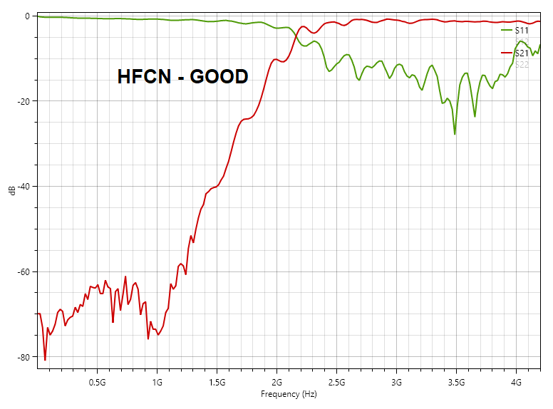
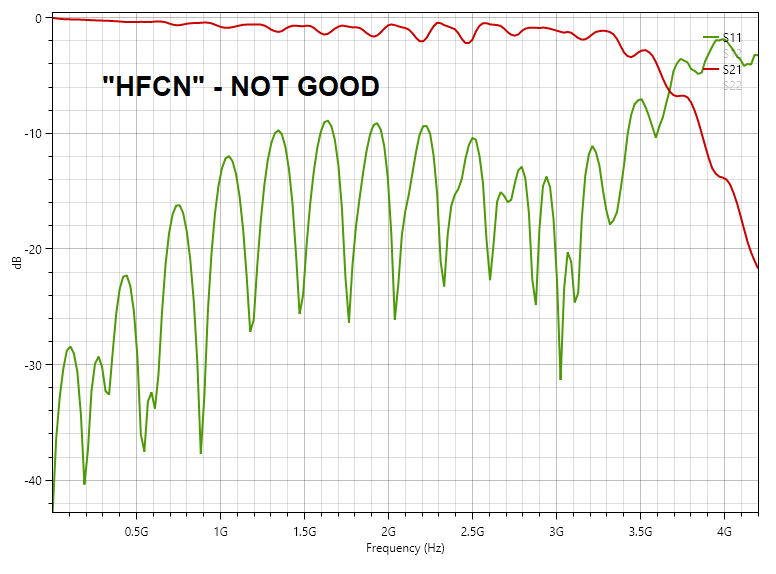

# Overview

This directory contains testing results for the high-pass and the low-pass routes on the 6GHz channel. The measurements have been done using the U.FL connectors and a NanoVNA V2.
The reason we put these measurements here is to show the importance of testing and sufficient test points when trouble shooting an RF circuit.

Revision R2.4 of the CaribouLite arrived and we immediately started testing them mainly on the lower frequency bands. A few days later, the strangest thing was observed. Both down- and up-conversion channels portrayed somewhat similar low-pass behavior, with very poor image rejection capabilities on the higher bands. Following this observation, few possible reasons that which could lead to the problem have been investigated. Of course, as usual, the most obvious reason is almost always the most probable.

The above picture is our lineup of suspected components to investigate thoroughly (writings in Hebrew). Many thanks to
* Nick from [GPIO Labs]([www.gpio](https://gpio.com/)) with your great connectorized products, and, of course
* [MCDI](https://www.mcdi-ltd.com/) - [Mini-Circuits](https://www.minicircuits.com/) exclusive representatives with their support to identify the problem.

**The reason was simple** - instead of the HFCN part (high-pass filter), an unidentified low-pass filter has been assembled. The source of error is still unknown but such errors are apparently quite common in low-volume production phases. Especially when the components contain no identifying features (e.g. ceramic multi-layer capacitors).

A touchstone file viewer shows the following characteristics for S21 (red line):
* The samples provided by **MCDI**:
  
* The components assembled on the CaribouLite boards:
  
  That guy over there is a very lousy high pass filter!

What should we learn from this experience:
1. Assembly / BOM sourcing mistakes happen - we need to take it into account when designing a board (mainly testpoints).
2. There are great tools for troubleshooting such problems, and they are totally accessible even for smaller entities - NanoVNA is one of them.
3. Checking the simplest possible source of mistake is favorable when debugging. And many times its the most probable reason.
4. Talk with your components companies representatives - they know their parts and they are willing to help.

# License
 This work is licensed under a <a rel="license" href="http://creativecommons.org/licenses/by-sa/4.0/">Creative Commons Attribution-ShareAlike 4.0 International License</a>.
