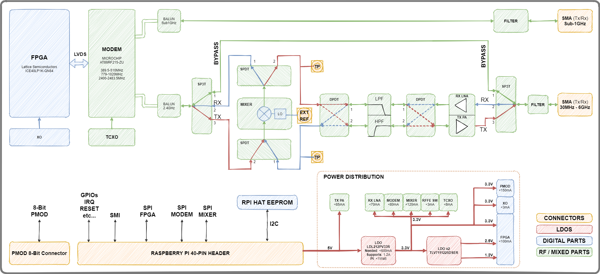

# CaribouLite Hardware Revisions
CaribouLite board has two revisions:
1. Rev1: A prototyping revision (the red board).
2. Rev2: Production revision.

This documentation shall cover the production revision board (rev2).

# System Diagram
<table>
  <tr>
    <td></td>
  </tr>
  <tr>
    <td>CaribouLite SDR System Diagram</td>
  </tr>
</table>

## Power Distribution
To simplify the board and its interfacing to the Raspberry Pi computer, all components on board operate with 3.3V. The FPGA further requires also 1.2V and 2.5V voltages. Two LDO components have been used to derive these voltages from the RPI 5V output voltage.

The usage of LDOs provides high level of voltage isolation, low emitted noise, and design simplicity. The downside of such choise it the dissipated heat from the LDOs. This heat is controlled by providing descent heat sinking to the board through the power planes and adjucent metalic elements (i.g. connectors).

The power distribution provides high frequency isolation of the RF components from the digital components (memory, RPI and FPGA) at frequencies lower than 10 MHz. Above 100 MHz additional isolation is provided by using ferrite beads with high impedance (>500 Ohms) at 100MHz. A set of filterring bypass capacitors have been chosen to further suppress noise generated by components on their power lines at mid-range frequencies (10 to 100 MHz) - the set contains 1nF, 100 nF and 4.7uF capacitors bypassing power and data lines effective at the said frequency ranges.

## RPI HAT EEPROM
TBD

## Clocking
TBD

## PMOD Connector
TBD

## FPGA and LVDS
TBD

## SPI
TBD

## RF PATH
TBD

### LNA & PA
TBD

### Image Rejection and Filterring
TBD

### Mixer
TBD

### Calibrations
TBD

# License
 This work is licensed under a <a rel="license" href="http://creativecommons.org/licenses/by/4.0/">Creative Commons Attribution 4.0 International License</a>.
