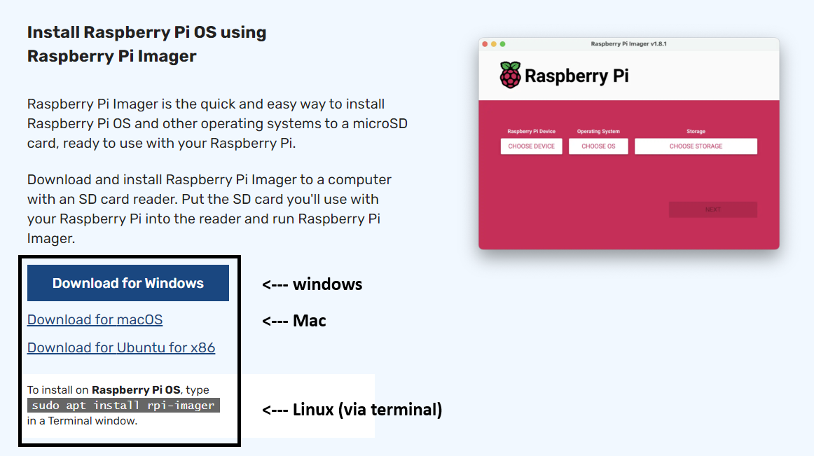
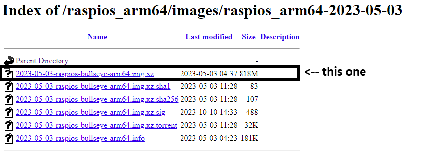
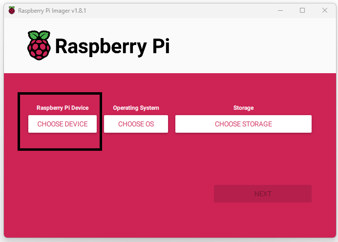
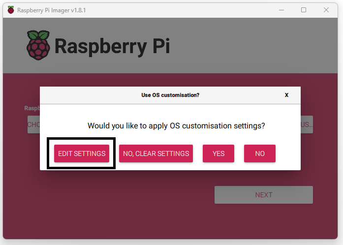
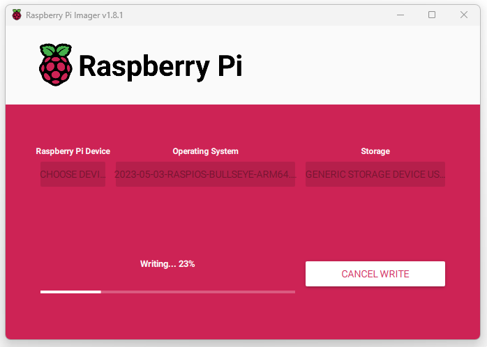
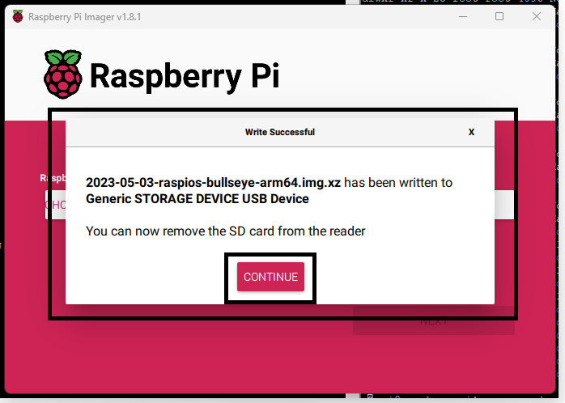
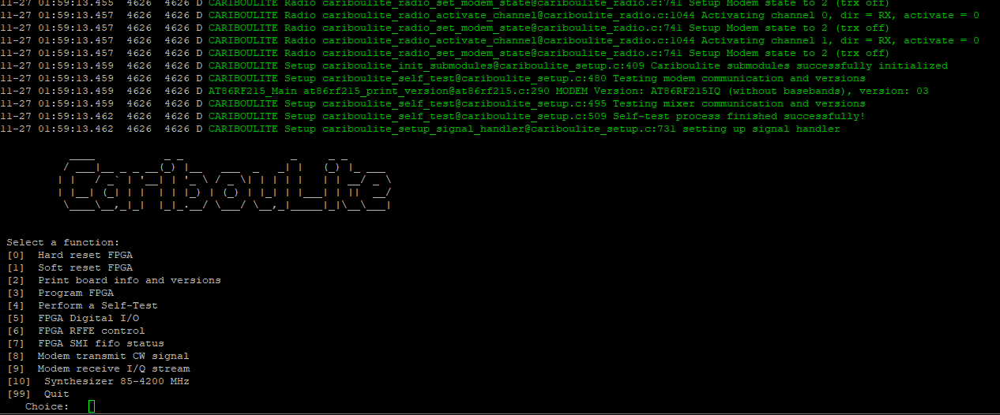
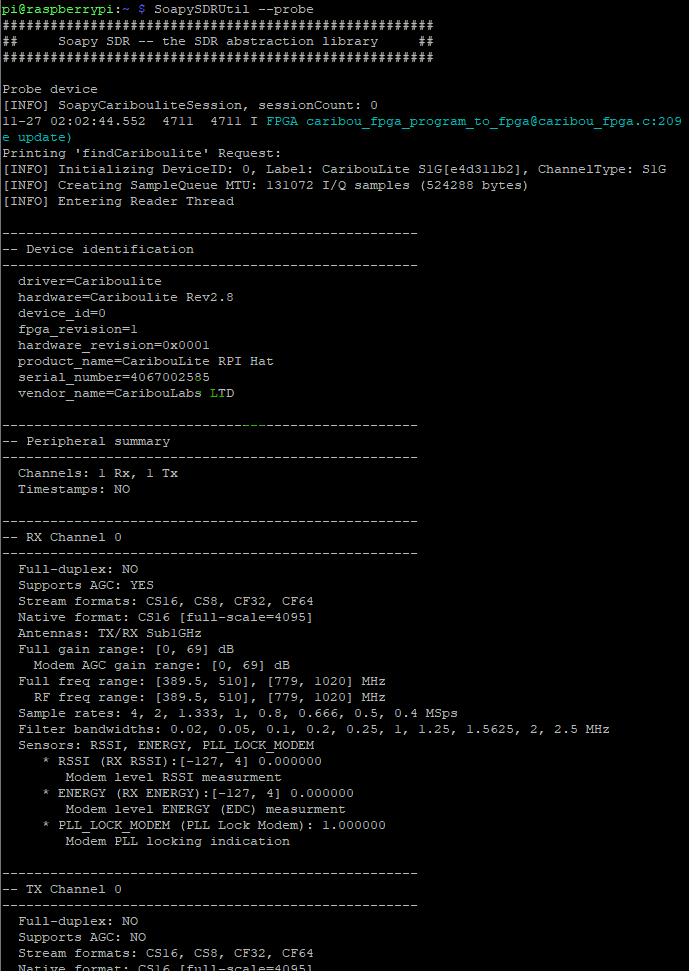

# Installation
**Note**: ***Issues with distro bookworm*** - the required kernel modules cannot compile agains the latest 6.1.0 'bookworm' distribution. Current version was tested with bullseye 6.1.21-*. See details bellow.

## Fresh SDCard preparation
1. Download and install Raspberry Pi imager:
   https://downloads.raspberrypi.org/raspios_arm64/images/raspios_arm64-2023-05-03/

   

2. Insert a micro-SD card for flashing. Note - the process will override the SD's previous contents.
3. Download the latest bullseye distribution from:
   https://downloads.raspberrypi.org/raspios_arm64/images/raspios_arm64-2023-05-03/

   
4. Start Raspberry Pi Imager and choose device:
   
   Note: Raspberry Pi 5 is not supported due to compatibility issues with the SMI communication.
5. Choosing the OS file downloaded in step (3):
   Click the "CHOOSE OS" button and drag down to "Use Custom". Then select the downloaded file.
6. Select the target storage - be very careful to choose the micro-SD card that was inserted into the computer. In cases where various such devices are present in the system, verify the correct card by removing / re-inserting while monitoring the storage selection menu.
7. Edit additional settings of the system:
      
   Make sure to enable ssh, apply a proper host name (default 'raspberrypi') and  a username / password to further communicate with the RPI through Ethernet / Wifi. Wifi SSID can also be configured through this process to enable the RPI automatically connect the local Wifi Network.
8. When the imager finished the process, remove the SDCard and insert into the Raspberry Pi.
   
   **Note**: do not remove the SDCard unless the images approits removel:
   


## Software Installation and API invokation
The newly prepared SDCard can be inserted into the Raspberry Pi. 
1. Mount Cariboulite on top of the RPI device and power it on.
2. Connecting the RPI is possible via direct Ethernet Cable, Wifi or by setting up a desktop environment with a display, keyboard and mouse.
3. During a fresh distro configuration we recommand using the desktop environment. Ethernet connection also possible through ssh.

**Connecting RPI through SSH**
- In Windows we use [Putty](https://www.putty.org) / [WinSCP](https://winscp.net)
- In Linux and Mac `ssh <username>@<hostname>`  though terminal.

**Installations**
1. In the terminal (ssh), clone cariboulite repository:
   `git clone https://github.com/cariboulabs/cariboulite.git`
   and:
   `git clone https://github.com/pothosware/SoapySDR.git`
2. Cmake installation and upgrade:
   `sudo apt update`

   if update is suggested by apt, use:
   `sudo apt upgrade` and follow instructions.

   Now CMAKE is installed by:
   `sudo apt install cmake`
3. Install SoapySDR:
   ```
   cd SoapySDR
   mkdir build && cd build
   cmake ../
   make -j4
   sudo make install
   ```
   Soapy SDR is a third party generic SDR API that can interact with CaribouLite (in addition to the native c/c++ APIs)
   
4. Install the software using CaribouLite's dedicated install script:
   ```
   cd ~/cariboulite       # note: depends on the exact location that was chosen for the package.
   ./install.sh
   ```
5. During this installation process, dependencies and kernel modules are being build and installed into the Linux system.
6. As the building process is finalized, the install script checks the `/boot/config.txt` file. **Note**: the exact location of the file varies between systems. In Raspbian this file shall typically be located in `/boot/config.txt`.
The installer notes on any mismatch between the actual and expected configuration. The configuration should be applied to the config file according to instructions given by the script.
7. As the building process finished, the APIs are installed into the system, including SoapySDR API, C and C++ API. The build artifacts will be located in the `build` sub-directory. 
8. After the installation process and the config.txt file editing are finished, reboot the system by:
`sudo reboot` and wait for the RPI to restart and initialize.

**Testing and interactions**
1. Testing the HAT connection and detection by running:
   `cat /proc/device-tree/hat/product`
   shiould yield the following output: 
   `CaribouLite RPI Hat`
2. Testing the `smi_stream` driver insertion:
   `lsmod | grep smi` should produce the following output:
   ```
   smi_stream_dev         20480  0
   bcm2835_smi            20480  1 smi_stream_dev
   ```
3. Testing through the dedicated testing app: within the `build` sub-directory, run the following:
`./cariboulite_test_app`
This application provides access to low / high level features of the board - board id, 

4. Testing the connection to the SoapySDR API. Use the following command to have the SoapySDR Util interract with the board and show it's information:
   `SoapySDRUtils --probe`
   The expected output shows the insterfacesm configurations and state of the board:
   
   
5. fdsfsd